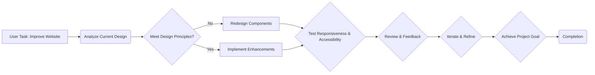

# SmartNation College Website Redesign Plan

**I. Project Goal:**

*   Redesign the SmartNation College website's main page to create a modern, professional, and user-friendly experience that increases engagement, particularly with the service cards.

**II. Target Audience:**

*   Prospective and current students.

**III. Design Principles:**

*   **Modern Aesthetics:** Clean lines, ample whitespace, subtle shadows, and a contemporary color palette.
*   **Intuitive Navigation:** Easy-to-understand site structure and clear calls to action.
*   **Clear Visual Hierarchy:** Guide users to key information and actions.
*   **Mobile Responsiveness:** Ensure a seamless experience on all devices.
*   **Accessibility:** Adhere to WCAG guidelines for accessibility.

**IV. Technical Implementation Plan:**

1.  **Font Setup:**
    *   Confirm that the Manrope font is correctly loaded and applied using `next/font/google` in `src/app/layout.tsx`.
    *   Verify that Tailwind CSS is configured to use Manrope as the default sans-serif font.
2.  **Color Palette:**
    *   Establish a consistent color palette based on the existing blue tones (`#3D6FD1`, `#294A8B`) and Tailwind's `slate` grays.
    *   Define these colors as Tailwind CSS variables for easy reuse and maintainability.
3.  **Header Redesign:**
    *   Simplify the header structure.
    *   Use clear, concise navigation links.
    *   Make the "Войти / Регистрация" button visually prominent.
    *   Ensure the header is responsive and adapts well to mobile devices.
4.  **Hero Section Enhancement:**
    *   Increase the prominence of the "Создать Документ" button (size, color, shadow).
    *   Refine the typography for the title and description for better readability and visual impact.
    *   Adjust the image overlay effect for a more modern look.
    *   Ensure the hero section is visually engaging and clearly communicates the website's purpose.
5.  **Service Cards Redesign:**
    *   Use a consistent card style with clear icons (from `lucide-react`), concise titles, and brief descriptions.
    *   Add a prominent "Узнать больше" link or button to each card.
    *   Implement a subtle hover effect to encourage interaction.
    *   Use a responsive grid layout to ensure the cards display well on all screen sizes.
6.  **About Us Section Refinement:**
    *   Simplify the layout and content for better readability.
    *   Present the statistics in a visually appealing and easy-to-understand format.
7.  **Contact Section Improvement:**
    *   Use clear icons and concise text to present contact information.
    *   Ensure the map placeholder is visually consistent with the overall design.
8.  **Footer Streamlining:**
    *   Organize the footer links into logical categories.
    *   Make the newsletter subscription form prominent and easy to use.
    *   Ensure the footer is visually appealing and consistent with the overall design.
9.  **Accessibility:**
    *   Use semantic HTML elements.
    *   Ensure sufficient color contrast for readability.
    *   Provide alternative text for all images.
    *   Make sure the site is navigable using a keyboard.
10. **Code Quality:**
    *   Use consistent naming conventions for CSS classes and variables.
    *   Write clean, well-commented code.
    *   Optimize images for performance.

**V. Mermaid Diagram:**

**VI. Implementation Steps (to be performed in Code Mode):**

1.  **Setup:**
    *   Verify Manrope font loading in `src/app/layout.tsx`.
    *   Define color palette in `tailwind.config.ts`.
2.  **Component-wise Redesign:**
    *   Header: Modify `src/app/page.tsx` to implement the new header design.
    *   Hero: Modify `src/app/page.tsx` to implement the new hero section design.
    *   Services: Modify `src/app/page.tsx` to implement the new service card design.
    *   About Us: Modify `src/app/page.tsx` to implement the new About Us section design.
    *   Contact: Modify `src/app/page.tsx` to implement the new contact section design.
    *   Footer: Modify `src/app/page.tsx` to implement the new footer design.
3.  **Testing & Refinement:**
    *   Test the website on different devices and screen sizes.
    *   Address any responsiveness or layout issues.
    *   Ensure accessibility guidelines are met.
4.  **Final Review:**
    *   Review the entire website to ensure visual consistency and adherence to the design principles.